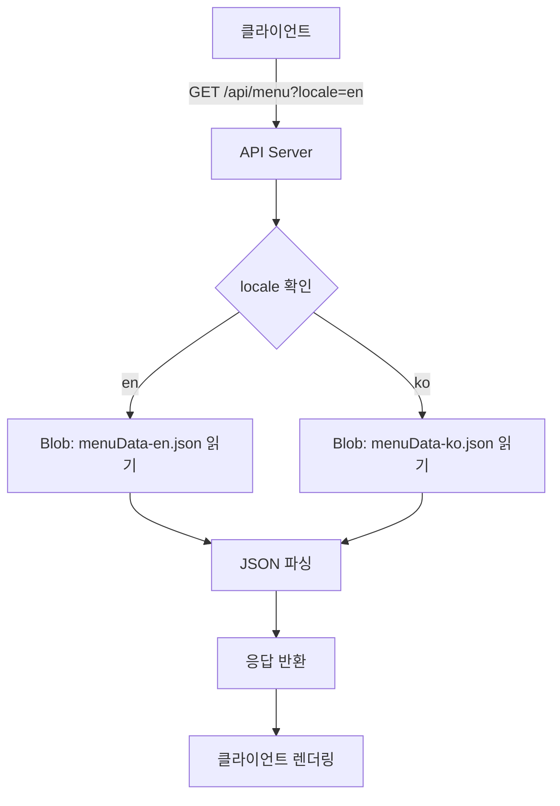
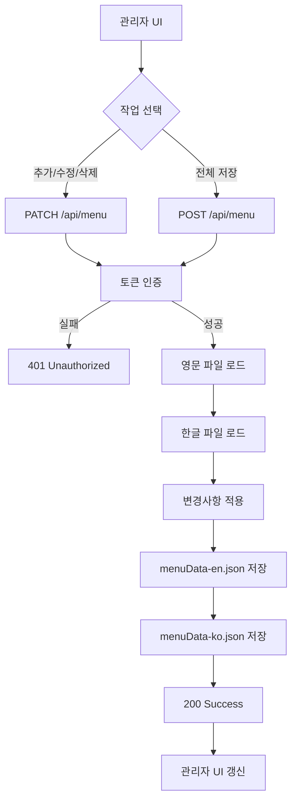

# 메뉴 다국어 데이터 저장/조회 설계

## 목적
- Vercel Blob에 **영어/한국어 메뉴 정보를 각각 별도 파일로 저장**
- 조회 시 **최소 페이로드**로 빠른 응답 제공
- 관리자는 **두 언어 모두를 동시에 편집/관리**

---

## Blob 파일 구성

```
menuData-en.json    (영어 버전)
menuData-ko.json    (한국어 버전)
```

---

## 데이터 형식 정의

### MenuData
전체 메뉴 구조 (로케일별 파일)

```typescript
{
  "categories": MenuCategory[]
}
```

### MenuCategory
카테고리 정의

```typescript
{
  "id": string,           // 고유 ID (예: "fried", "soup")
  "name": string,         // 카테고리 이름 (로케일별)
  "description": string,  // 카테고리 설명 (로케일별)
  "items": MenuItem[]     // 메뉴 항목들
}
```

### MenuItem
메뉴 항목 정의

```typescript
{
  "image": string | null,  // 이미지 URL (Vercel Blob URL)
  "title": string,         // 메뉴 제목 (로케일별)
  "ingredients": string,   // 재료 설명 (로케일별)
  "price": string          // 가격 (공통)
}
```

### 예시: menuData-en.json
```json
{
  "categories": [
    {
      "id": "fried",
      "name": "Fried",
      "description": "Deep fried favorites",
      "items": [
        {
          "image": "https://blob.vercel-storage.com/...",
          "title": "Garlic Soy Chicken",
          "ingredients": "Chicken, garlic, soy sauce",
          "price": "$18"
        },
        {
          "image": "https://blob.vercel-storage.com/...",
          "title": "Seafood Pancake",
          "ingredients": "Seafood, flour, vegetables",
          "price": "$15"
        }
      ]
    }
  ]
}
```

### 예시: menuData-ko.json
```json
{
  "categories": [
    {
      "id": "fried",
      "name": "튀김",
      "description": "바삭한 튀김 메뉴",
      "items": [
        {
          "image": "https://blob.vercel-storage.com/...",
          "title": "마늘간장치킨",
          "ingredients": "닭고기, 마늘, 간장",
          "price": "$18"
        },
        {
          "image": "https://blob.vercel-storage.com/...",
          "title": "해물파전",
          "ingredients": "해물, 밀가루, 야채",
          "price": "$15"
        }
      ]
    }
  ]
}
```

---

## API 정의

### 1. GET /api/menu
메뉴 데이터 조회

**인증:** 없음 (공개 API)

**쿼리 파라미터:**
- `locale` (선택): `en` 또는 `ko` (기본값: `en`)

**응답 예시 (locale=en):**
```json
{
  "categories": [
    {
      "id": "fried",
      "name": "Fried",
      "description": "Deep fried favorites",
      "items": [
        {
          "image": "https://...",
          "title": "Garlic Soy Chicken",
          "ingredients": "Chicken, garlic, soy sauce",
          "price": "$18"
        }
      ]
    }
  ]
}
```

**HTTP 상태 코드:**
- `200`: 성공
- `500`: 서버 오류

---

### 2. POST /api/menu
메뉴 전체 데이터 저장 (덮어쓰기)

**인증:** 필요 (Bearer Token)

**요청 본문:**
```json
{
  "en": {
    "categories": [/* MenuCategory[] */]
  },
  "ko": {
    "categories": [/* MenuCategory[] */]
  }
}
```

**응답:**
```json
{
  "message": "Menu data updated successfully"
}
```

**HTTP 상태 코드:**
- `200`: 성공
- `401`: 인증 실패
- `500`: 서버 오류

---

### 3. PATCH /api/menu
메뉴 항목 추가/수정/삭제

**인증:** 필요 (Bearer Token)

**요청 본문 - 추가:**
```json
{
  "action": "add",
  "categoryId": "fried",
  "data": {
    "en": {
      "image": "https://...",
      "title": "New Item",
      "ingredients": "Ingredients",
      "price": "$10"
    },
    "ko": {
      "image": "https://...",
      "title": "새 메뉴",
      "ingredients": "재료",
      "price": "$10"
    }
  }
}
```

**요청 본문 - 수정:**
```json
{
  "action": "update",
  "categoryId": "fried",
  "itemIndex": 0,
  "data": {
    "en": {
      "title": "Updated Title"
    },
    "ko": {
      "title": "수정된 제목"
    }
  }
}
```

**요청 본문 - 삭제:**
```json
{
  "action": "delete",
  "categoryId": "fried",
  "itemIndex": 0
}
```

**응답:**
```json
{
  "message": "Menu data updated successfully"
}
```

**HTTP 상태 코드:**
- `200`: 성공
- `401`: 인증 실패
- `500`: 서버 오류

---

## 워크플로우 차트

### 1) 메뉴 받아오기 (GET)



#### 상세 플로우
1. 클라이언트가 `/api/menu?locale=en` 요청
2. API 서버가 locale 파라미터 확인
3. Vercel Blob에서 `menuData-{locale}.json` 파일 조회
4. 파일 내용을 JSON으로 파싱
5. 클라이언트에게 응답 반환
6. 클라이언트가 메뉴 렌더링

---

### 2) 메뉴 추가/수정/삭제 (PATCH/POST)



#### 상세 플로우 (PATCH - 항목 추가)
1. 관리자가 새 메뉴 항목 추가 (영어/한글 동시 입력)
2. `PATCH /api/menu` 요청 (action: "add")
3. Bearer Token 인증
4. Blob에서 `menuData-en.json` 로드
5. Blob에서 `menuData-ko.json` 로드
6. 각 파일에 새 항목 추가
7. `menuData-en.json` 저장
8. `menuData-ko.json` 저장
9. 성공 응답 반환
10. 관리자 UI 상태 갱신

#### 상세 플로우 (PATCH - 항목 수정)
1. 관리자가 기존 항목 수정 (영어/한글 동시 수정)
2. `PATCH /api/menu` 요청 (action: "update")
3. Bearer Token 인증
4. Blob에서 양쪽 파일 로드
5. categoryId와 itemIndex로 항목 찾기
6. 해당 항목 업데이트
7. 양쪽 파일 저장
8. 성공 응답 반환

#### 상세 플로우 (PATCH - 항목 삭제)
1. 관리자가 항목 삭제 확인
2. `PATCH /api/menu` 요청 (action: "delete")
3. Bearer Token 인증
4. Blob에서 양쪽 파일 로드
5. categoryId와 itemIndex로 항목 찾기
6. 해당 항목 삭제 (이미지가 있으면 Blob에서 이미지도 삭제)
7. 양쪽 파일 저장
8. 성공 응답 반환

---

## 구현 고려사항

### 1. 데이터 일관성
- 영어/한글 파일은 **항상 동시에 업데이트**
- categoryId와 항목 순서(itemIndex)는 **양쪽 파일에서 동일**하게 유지
- 한쪽 파일 저장 실패 시 **트랜잭션 롤백** 필요

### 2. 성능 최적화
- CDN 캐시 활용 (`Cache-Control: public, s-maxage=60`)
- ETag 기반 재검증
- 로케일별 URL 분리로 캐시 효율 극대화

### 3. 에러 처리
- Blob 파일이 없는 경우: 빈 categories 배열 반환
- 인증 실패: 401 Unauthorized
- 서버 오류: 500 Internal Server Error
- 잘못된 요청: 400 Bad Request

### 4. 보안
- 관리자 API는 JWT Bearer Token 인증 필수
- 토큰 유효성 검증 (만료 시간, 서명)
- CORS 정책 적용

---

## 관리자 UI 동작 방식

### 언어 탭 전환
- 관리자는 English/한국어 탭으로 전환하며 입력
- 각 필드(title, ingredients)를 언어별로 입력
- 저장 시 두 언어 데이터를 함께 전송

### 데이터 검증
- 필수 필드 체크 (title, price)
- 이미지 업로드 완료 확인
- 번역 누락 경고 (선택적)

### 낙관적 업데이트
- UI에서 먼저 상태 반영
- API 실패 시 이전 상태로 롤백

---

## 마이그레이션 가이드

### 기존 단일 언어 데이터 → 로케일별 파일

기존에 `menuData.json` 하나만 있었다면:

1. 기존 파일을 `menuData-en.json`으로 복사
2. `menuData-ko.json` 생성 (번역 필요)
3. 관리자 UI에서 한글 번역 입력
4. 저장 시 양쪽 파일 동시 업데이트

---

## 캐시 전략

### CDN 캐시
```
Cache-Control: public, s-maxage=60, stale-while-revalidate=300
ETag: "hash-of-file-content"
```

### 클라이언트 캐시
- 로케일 전환 시 기존 데이터 유지
- 새로고침 시 ETag로 변경사항만 확인

---

## 모니터링 포인트

1. Blob 읽기/쓰기 빈도
2. API 응답 시간 (로케일별)
3. 캐시 히트율
4. 관리자 저장 성공/실패율
5. 데이터 일관성 검증 (양쪽 파일의 categoryId/itemIndex 일치)
